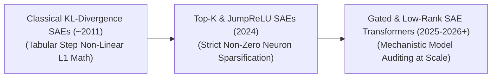

# Awesome-Sparse-Autoencoders

  

  

> **Awesome Sparse Autoencoders (SAEs)**: A curated list of evolutionary phases, mathematical variants, mechanistic interpretability diagnostics, policy steering, and safety auditing techniques for Large Language Models (LLMs).

## 🧠 Sparse Autoencoders (SAEs): Evolution, Variants, Types, & Applications 🚀

A Sparse Autoencoder (SAE) is an unsupervised neural network architecture designed to learn highly compressed, information-dense, and interpretable feature representations from raw input data. Structurally, an autoencoder consists of an **Encoder** that projects input data into a hidden bottleneck layer (the latent space), and a **Decoder** that reconstructs the original input from this hidden state. While standard autoencoders compress data by drastically shrinking the physical size of the bottleneck layer, Sparse Autoencoders take an alternative architectural path: they make the hidden layer **significantly larger** than the input layer (overcomplete), but enforce strict mathematical regularization penalties that force the network to keep the vast majority of hidden neurons completely inactive (zero or near-zero values) for any given input sample. 

In modern artificial intelligence, SAEs have undergone a massive resurgence, transforming from early tabular data pre-trainers into the primary reverse-engineering tool for **Mechanistic Interpretability**, unlocking the ability to map, isolate, and audit individual "concept neurons" hidden inside multi-billion parameter Large Language Models (LLMs).

---

## 📅 1. The Chronological Evolution

The technical progression of sparse autoencoding has transitioned from classical tabular density regularizers to large-scale, dictionary-learning model auditing engines integrated with modern transformer scaling boundaries.

| Era / Phase | Description | First Used Year | First Used Paper |
| :--- | :--- | :--- | :--- |
| [**The Classical Tabular Regularization Era (~2011–2018)**](details/classical_tabular_regularization.md) | **Concept:** The early foundation era. SAEs were utilized to extract robust features from low-dimensional tabular data or pixel frames before standard classification. Sparsity was enforced gently by penalizing the average activation of a hidden unit using an $L_1$ norm or a **Kullback-Leibler (KL) Divergence** penalty layer against a tiny target firing rate (e.g., forcing neurons to fire only 5% of the time).  **Limitation:** Prone to "shrinkage bias" where the $L_1$ penalty artificially compresses the magnitude of active features, degrading the quality of downstream data reconstruction. | 2011 | [CS294A Lecture Notes: Sparse Autoencoder](https://web.stanford.edu/class/cs294a/sparseAutoencoder.pdf) (Ng, 2011) |
| [**The Mechanistic Interpretability & Top-K Revolution (~2024–2025)**](details/mechanistic_interpretability_topk_revolution.md) | **Concept:** Spearheaded by teams at Anthropic and OpenAI. Researchers realized that an LLM's internal representation space contains millions of conceptual features wrapped inside an intertwined, compressed vector space (superposition). SAEs were repurposed to act as a "dictionary learning" microscope: trained directly over the intermediate activation layers of operational transformers to unwrap and extract thousands of distinct, human-interpretable features. This era standardized **Top-K SAEs** and **JumpReLU SAEs**, completely replacing smooth $L_1$ penalties with hard mathematical constraints that force the model to activate only the top $K$ most dominant neurons per token step. | 2024 | [Scaling and Evaluating Sparse Autoencoders](https://arxiv.org/abs/2406.04093) (Gao et al., 2024) |
| [**The Gated, Low-Rank, & Unified Scaled Era (~2025–Present)**](details/gated_low_rank_unified_scaled.md) | **Concept:** The current modern state-of-the-art framework built to scale across frontier models. It resolves the computational overhead of scaling dictionary sizes into the millions of elements. Modern variants implement **Gated SAEs** (separating the neuron activation decision from its magnitude tracking) and **Low-Rank SAE Architectures**, allowing distributed cluster setups to map the hidden conceptual states of multi-hundred-billion parameter deep networks cleanly. | 2024 | [Improving Dictionary Learning with Gated Sparse Autoencoders](https://arxiv.org/abs/2404.16014) (Rajamanoharan et al., 2024) |

---

## 🧬 2. Core Functional & Sparsity Variants

The Sparse Autoencoder family tree features specialized mathematical formulations designed to govern how the hidden neuron activations are constrained and normalized.

| Variant | Mechanism & Key Characteristics | First Used Year | First Used Paper |
| :--- | :--- | :--- | :--- |
| [**$L_1$ Regularized SAEs**](details/l1_regularized_saes.md) | Appends an absolute magnitude penalty ($\lambda \sum \|h_i\|$) to the reconstruction loss function, creating a soft constraint that gently coaxes the optimization graph to push low-yield hidden states down to zero. | 2007 | [Efficient Learning of Sparse Representations with an Energy-Based Model](https://yann.lecun.com/exdb/publis/pdf/ranzato-neco-07.pdf) (Ranzato et al., 2007) |
| [**Top-K SAEs**](details/top_k_saes.md) | **Mechanism:** Completely drops the volatile $L_1$ loss penalty during the forward execution pass. Instead, it applies a strict non-linear **Top-K sorting operator** straight over the hidden bottleneck activations. It retains the exact numerical values of the $K$ absolute largest neural signals, while instantly forcing all remaining hidden units across the overcomplete tensor to zero.  **Pros:** Eliminates shrinkage bias entirely and provides explicit, predictable control over the absolute sparsity level per execution token. | 2013 | [k-Sparse Autoencoders](https://arxiv.org/abs/1312.5663) (Makhzani & Frey, 2013) |
| [**JumpReLU SAEs**](details/jumprelu_saes.md) | **Mechanism:** Deploys a specialized activation curve featuring a hard discontinuous step threshold. If a neuron's activation is below a specific value $\epsilon$, its output is zero. The moment it crosses $\epsilon$, its output jumps instantly to a linear or curved value scale.  **Pros:** Captures highly discrete, sharp "on/off" concept states accurately, matching the binary nature of abstract human logic. | 2024 | [Jumping Ahead: Improving Reconstruction Fidelity with JumpReLU Sparse Autoencoders](https://arxiv.org/abs/2407.14454) (Rajamanoharan et al., 2024) |
| [**Gated SAEs**](details/gated_saes.md) | **Mechanism:** Utilizes a dual-tower gating matrix calculation within the bottleneck layer, replicating the mathematical logic of SwiGLU activations. One hidden path determines *whether* a concept is present (the gate), while its parallel twin computes the *magnitude* of that concept if activated. | 2024 | [Improving Dictionary Learning with Gated Sparse Autoencoders](https://arxiv.org/abs/2404.16014) (Rajamanoharan et al., 2024) |

---

## 🔍 3. Post-Training Interpretability & Auditing Classes

Depending on how an SAE interfaces with an operational neural network stack during research and verification passes, it fulfills distinct safety and analysis pipelines.

| Auditing Class | Profile & Auditing Role | First Used Year | First Used Paper |
| :--- | :--- | :--- | :--- |
| [**Monosemantic Feature Extraction (Dictionary Learning)**](details/monosemantic_feature_extraction.md) | Acts as an analytical layer wrapped around the hidden layers of a frozen base LLM. The SAE trains exclusively over billions of token activation vectors extracted from the base model during a standard reading run, successfully separating overlapping data into discrete, **monosemantic feature neurons** (e.g., isolating a single neuron that fires *only* when the text discusses corporate tax avoidance). | 2023 | [Towards Monosemanticity: Decomposing Language Models With Dictionary Learning](https://transformer-circuits.pub/2023/monosemantic-features/index.html) (Bricken et al., 2023) |
| [**Steerable Concept Intervention (Policy Steering)**](details/steerable_concept_intervention.md) | Moves past passive observation to active control. Once a monosemantic feature node is located via the SAE, engineers can apply an explicit scalar multiplier to clamp its activation value directly at inference time (e.g., artificially amplifying a "safety caution" feature neuron to force the model to adopt a highly risk-averse conversational persona dynamically). | 2024 | [Scaling Monosemanticity: Extracting Interpretable Features from Claude 3 Sonnet](https://transformer-circuits.pub/2024/scaling-monosemanticity/index.html) (Templeton et al., 2024) |
| [**Deceptive Alignment & Backdoor Screening**](details/deceptive_alignment_backdoor_screening.md) | Fills a critical safety engineering role in Model Alignment. SAE arrays monitor deep networks to check whether they contain hidden, adversarial behavioral triggers or latent deceptive states that standard superficial text evaluations fail to surface. | 2024 | [Scaling Monosemanticity: Extracting Interpretable Features from Claude 3 Sonnet](https://transformer-circuits.pub/2024/scaling-monosemanticity/index.html) (Templeton et al., 2024) |

---

## ⚙️ 4. Production Engineering Challenges & Hardware Solutions

Deploying large-scale SAE analysis matrices over massive, industrial deep learning models introduces intense memory bottlenecks and token processing latency.

| Challenge | Problem Description & Mitigation Strategy | First Used Year | First Used Paper |
| :--- | :--- | :--- | :--- |
| [**The Overcomplete Layer Parameter Explosion Wall**](details/overcomplete_layer_parameter_explosion.md) | **The Problem:** To unwrap the highly compressed concepts of an LLM layer, the SAE's bottleneck layer must be scaled up to be $16\times$, $32\times$, or even $128\times$ wider than the model's native hidden dimension ($d_{model}$). For a model with a $d_{model}$ of 8,192, a $32\times$ overcomplete SAE layer requires tracking over 262,144 hidden units *per individual layer block*. Scaling this across a 100-layer network creates an unsustainable parameter explosion that saturates VRAM.  **Mitigation:** Implementing **Low-Rank Matrix Factoring or Shared Dictionary Abstractions**, combined with multi-node model-parallel tensor sharding to distribute the SAE parameter weights cleanly across high-speed NVLink hardware clusters. | 2024 | [Scaling and Evaluating Sparse Autoencoders](https://arxiv.org/abs/2406.04093) (Gao et al., 2024) |
| [**The Dead Feature Redundancy Stagnation**](details/dead_feature_redundancy_stagnation.md) | **The Problem:** During the heavy optimization loops of an overcomplete SAE, the system frequently falls victim to **Feature Collapse** (dead features), where a massive percentage of the dictionary neurons permanently cease to fire, dropping the model's effective mathematical rank and wasting hardware compute capacity.  **Mitigation:** Implementing **Dynamic Re-initialization Schedules** (such as looking up high-error input activation paths and dynamically swapping dead neuron coordinates to match those unresolved features on-the-fly at runtime). | 2023 | [Towards Monosemanticity: Decomposing Language Models With Dictionary Learning](https://transformer-circuits.pub/2023/monosemantic-features/index.html) (Bricken et al., 2023) |

---

## 🛡️ 5. Frontier Real-World AI Safety Applications

| Safety Application | Use Case & Details | First Used Year | First Used Paper |
| :--- | :--- | :--- | :--- |
| [**Mechanistic Interpretability Diagnostics for Frontier LLMs**](details/mechanistic_interpretability_diagnostics.md) | Deployed within elite AI research laboratories (e.g., Anthropic Claude or OpenAI safety alignment loops). SAE engines map millions of internalized text and code features across deep transformer hidden layers, translating abstract statistical numbers into a clean, searchable, and auditable encyclopedia of conceptual nodes. | 2024 | [Scaling Monosemanticity: Extracting Interpretable Features from Claude 3 Sonnet](https://transformer-circuits.pub/2024/scaling-monosemanticity/index.html) (Templeton et al., 2024) |
| [**Automated Corporate Regulatory & Compliance Auditing**](details/corporate_regulatory_compliance_auditing.md) | Deep text perception layers operating within highly restricted financial and legal workflows pass operational prompts through fine-grained SAE filters. The system monitors feature node triggers continuously, flagging and blocking compliance violations (e.g., insider trading intent or data privacy breaches) early in hidden layer processing blocks before output characters are synthesized. | 2024 | [Scaling Monosemanticity: Extracting Interpretable Features from Claude 3 Sonnet](https://transformer-circuits.pub/2024/scaling-monosemanticity/index.html) (Templeton et al., 2024) |
| [**AI Safeguard Hardening Against Jailbreaking and Prompt Injection**](details/ai_safeguard_hardening_jailbreaking.md) | Hardens the security parameters of consumer-facing AI agents. Safety systems evaluate whether incoming malicious prompts contain hidden, multi-turn adversarial data paths by tracking whether they trigger structural feature clusters within an SAE-mapped hidden layer, dynamically neutralizing prompt execution before dangerous cross-platform tools are dispatched. | 2024 | [Scaling Monosemanticity: Extracting Interpretable Features from Claude 3 Sonnet](https://transformer-circuits.pub/2024/scaling-monosemanticity/index.html) (Templeton et al., 2024) |
