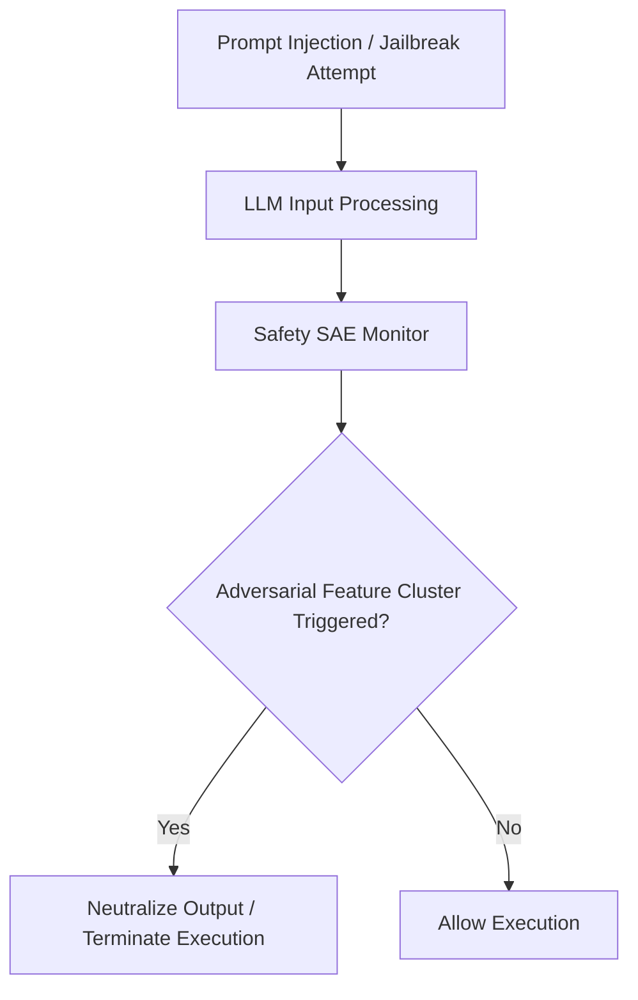

# AI Safeguard Hardening Against Jailbreaking and Prompt Injection

Safety systems evaluate whether incoming malicious prompts contain hidden, multi-turn adversarial data paths.

## Core Mechanics
SAEs track whether incoming inputs trigger structural feature clusters within an SAE-mapped hidden layer, dynamically neutralizing prompt execution before dangerous cross-platform tools are dispatched.

## Architectural Diagram

[Back to README](../README.md)
