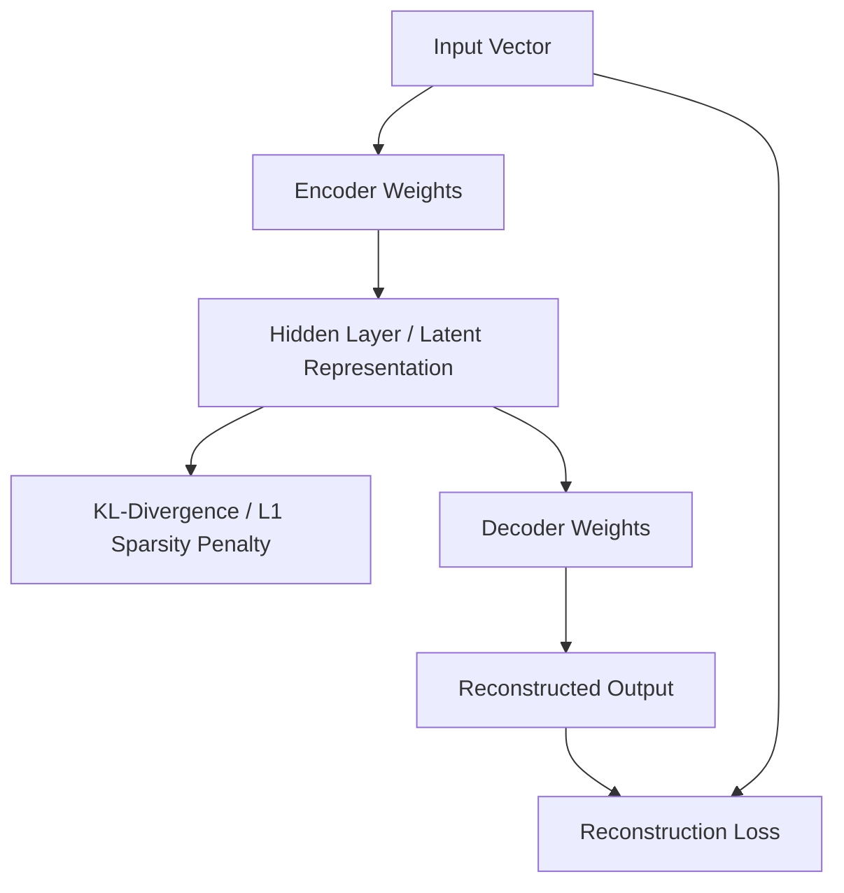

# The Classical Tabular Regularization Era (~2011–2018)

In the early foundation era of representation learning, Sparse Autoencoders (SAEs) were primarily utilized to extract robust features from low-dimensional tabular data or pixel frames before feeding them into standard classifiers. 

## Core Mechanics
Sparsity was enforced gently by penalizing the average activation of a hidden unit using an L1 norm or a **Kullback-Leibler (KL) Divergence** penalty layer against a tiny target firing rate (e.g., forcing neurons to fire only 5% of the time).

## Mathematical Formulation
$$L_{total} = L_{reconstruction} + eta D_{KL}(
ho \parallel \hat{\rho})$$

Where $\rho$ is the target sparsity parameter and $\hat{\rho}$ is the average activation of the hidden units.

## Architectural Diagram

## Limitations
This era was prone to "shrinkage bias" where the L1 penalty artificially compresses the magnitude of active features, degrading the quality of downstream data reconstruction.

[Back to README](../README.md)
