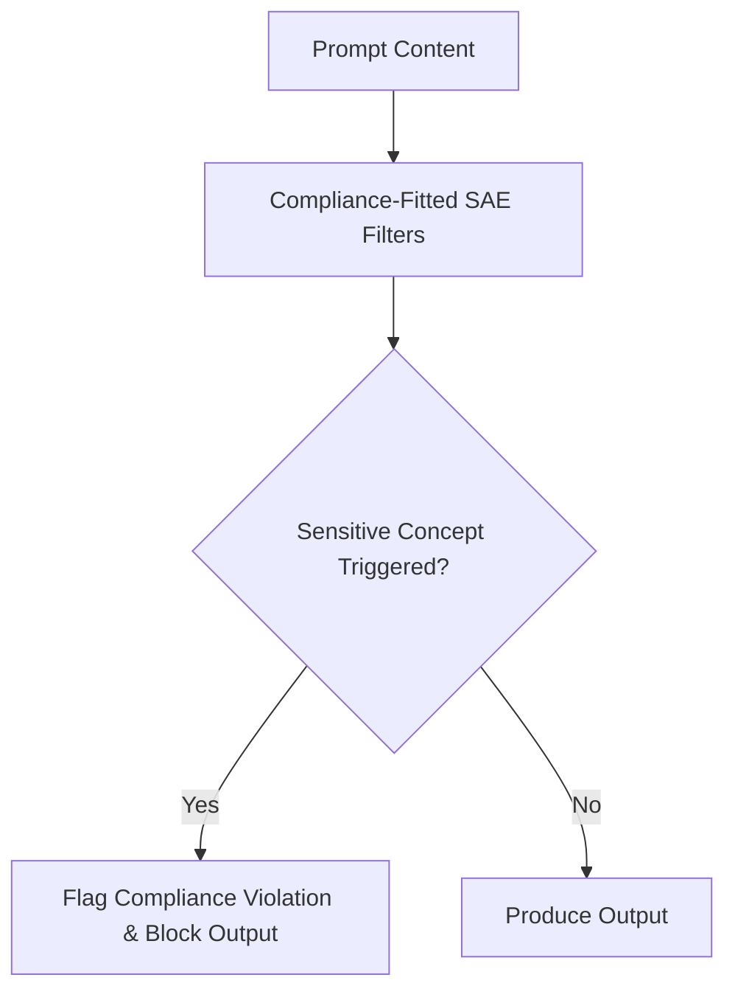

# Automated Corporate Regulatory & Compliance Auditing

Deep text perception layers operating within highly restricted financial and legal workflows pass operational prompts through fine-grained SAE filters.

## Core Mechanics
The system monitors feature node triggers continuously, flagging and blocking compliance violations (e.g., insider trading intent or data privacy breaches) early in hidden layer processing blocks before output characters are synthesized.

## Architectural Diagram

[Back to README](../README.md)
