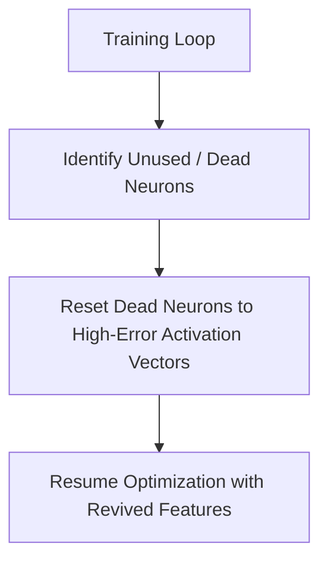

# The Dead Feature Redundancy Stagnation

Feature collapse is a primary challenge during the heavy optimization loops of overcomplete SAEs.

## The Challenge
During training, the system frequently falls victim to **Feature Collapse** (dead features), where a massive percentage of the dictionary neurons permanently cease to fire, dropping the model's effective mathematical rank and wasting hardware compute capacity.

## Mitigation
Implementing **Dynamic Re-initialization Schedules** (such as looking up high-error input activation paths and dynamically swapping dead neuron coordinates to match those unresolved features on-the-fly at runtime).

## Architectural Diagram

[Back to README](../README.md)
