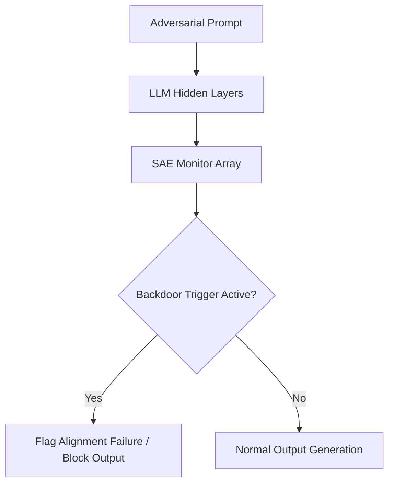

# Deceptive Alignment & Backdoor Screening

SAE arrays monitor deep networks to check whether they contain hidden, adversarial behavioral triggers or latent deceptive states.

## Core Mechanics
Traditional superficial text evaluations fail to surface deceptive alignment (where a model behaves safely only during evaluation to avoid modification). SAEs monitor the internal activation path, identifying if safety filters are bypassed or if specific backdoors/triggers are activated in the hidden layers.

## Architectural Diagram

[Back to README](../README.md)
