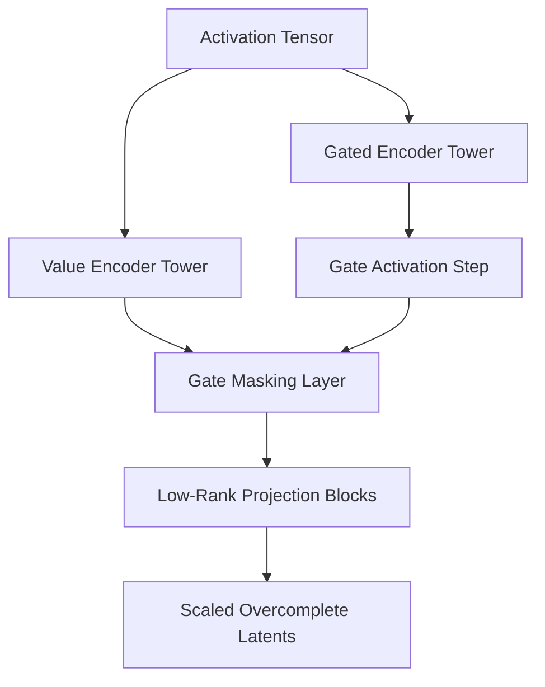

# The Gated, Low-Rank, & Unified Scaled Era (~2025–Present)

The current modern state-of-the-art framework built to scale dictionary learning across frontier models with hundreds of billions of parameters.

## Core Mechanics
This era resolves the massive computational overhead of scaling dictionary sizes to millions of elements. Modern variants implement **Gated SAEs** (separating the neuron activation decision from its magnitude tracking) and **Low-Rank SAE Architectures**, allowing distributed cluster setups to map the hidden conceptual states of massive deep networks cleanly.

## Architectural Diagram

[Back to README](../README.md)
