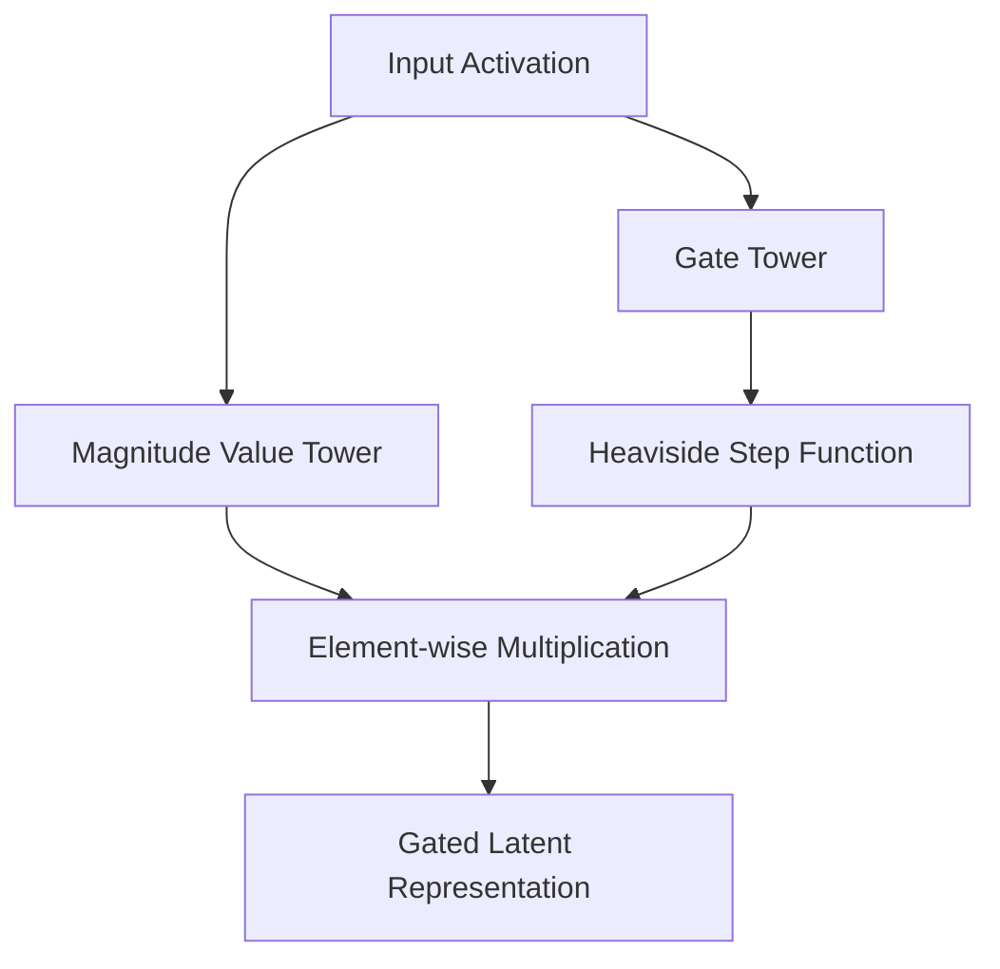

# Gated SAEs

Gated Sparse Autoencoders utilize a dual-tower gating matrix calculation within the bottleneck layer.

## Core Mechanics
One hidden path determines *whether* a concept is present (the gate), while its parallel twin computes the *magnitude* of that concept if activated. This replicates the mathematical logic of SwiGLU activations and resolves the reconstruction magnitude shrinkage issue.

## Architectural Diagram

[Back to README](../README.md)
