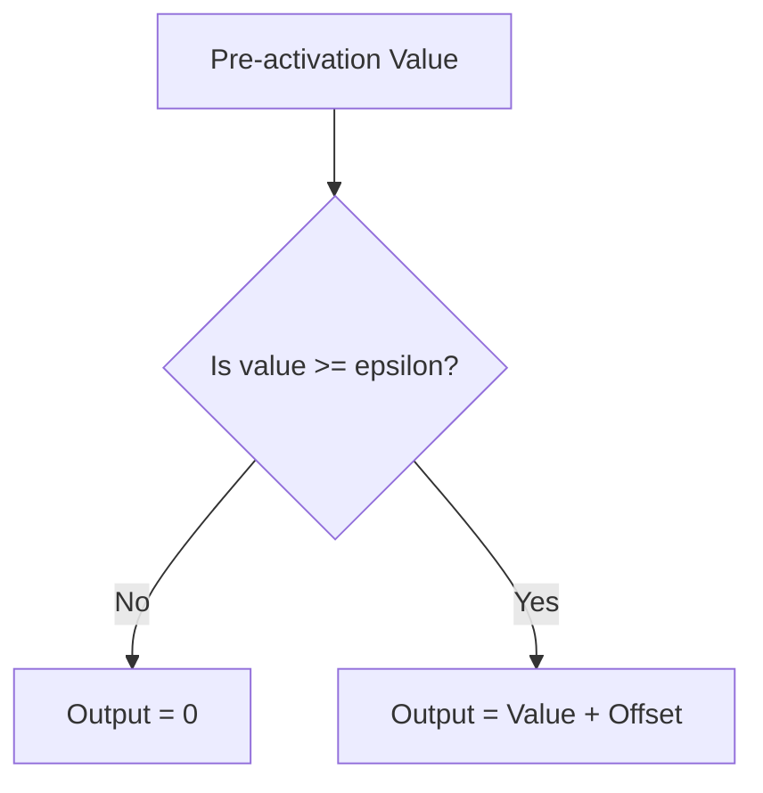

# JumpReLU SAEs

JumpReLU Sparse Autoencoders deploy a specialized activation curve featuring a hard discontinuous step threshold.

## Core Mechanics
If a neuron's activation is below a specific value $\epsilon$, its output is zero. The moment it crosses $\epsilon$, its output jumps instantly to a linear or curved value scale. This captures highly discrete, sharp "on/off" concept states accurately, matching the binary nature of abstract human logic.

## Architectural Diagram

[Back to README](../README.md)
