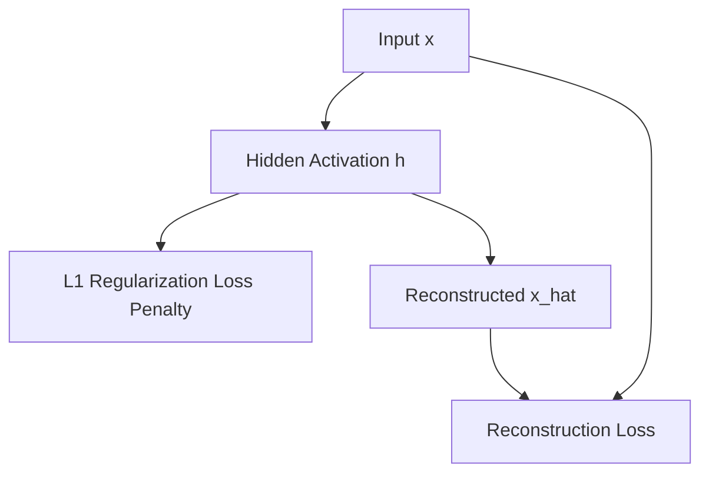

# L1 Regularized SAEs

L1 Regularized Sparse Autoencoders append an absolute magnitude penalty to the loss function to encourage sparsity in the hidden activations.

## Core Mechanics
The loss function appends an absolute magnitude penalty ($\lambda \sum |h_i|$) to the reconstruction loss, creating a soft constraint that gently coaxes the optimization graph to push low-yield hidden states down to zero.

## Mathematical Formulation
$$L = \|x - \hat{x}\|^2 + \lambda \sum_{i} |h_i|$$

## Architectural Diagram

[Back to README](../README.md)
