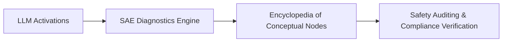

# Mechanistic Interpretability Diagnostics for Frontier LLMs

SAE engines map millions of internalized text and code features across deep transformer hidden layers.

## Core Mechanics
This transforms abstract statistical numbers into a clean, searchable, and auditable encyclopedia of conceptual nodes. Deployed within safety alignment loops, it helps audit model beliefs, biases, and knowledge representations.

## Architectural Diagram

[Back to README](../README.md)
