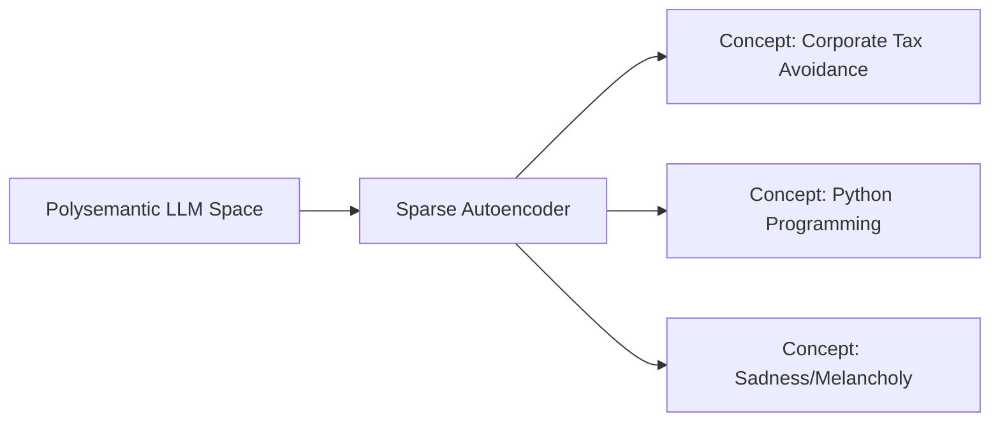

# Monosemantic Feature Extraction (Dictionary Learning)

Monosemantic feature extraction acts as an analytical layer wrapped around the hidden layers of a frozen base LLM.

## Core Mechanics
The SAE trains exclusively over billions of token activation vectors extracted from the base model during a standard reading run, successfully separating overlapping data into discrete, **monosemantic feature neurons** (e.g., isolating a single neuron that fires *only* when the text discusses corporate tax avoidance).

## Architectural Diagram

[Back to README](../README.md)
