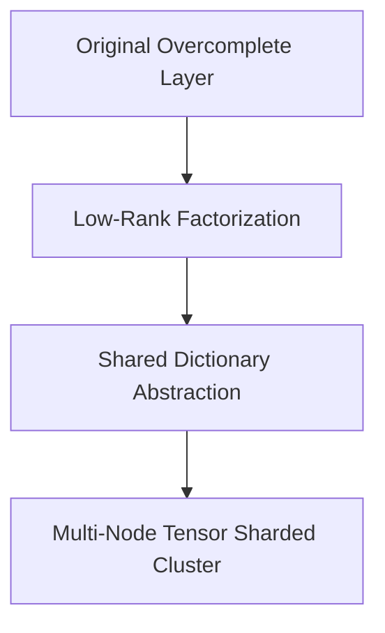

# The Overcomplete Layer Parameter Explosion Wall

Scaling dictionary sizes into the millions of elements introduces intense memory bottlenecks and token processing latency.

## The Challenge
To unwrap the highly compressed concepts of an LLM layer, the SAE's bottleneck layer must be scaled up to be $16\times$, $32\times$, or even $128\times$ wider than the model's native hidden dimension ($d_{model}$). For a model with a $d_{model}$ of 8,192, a $32\times$ overcomplete SAE layer requires tracking over 262,144 hidden units *per individual layer block*. Scaling this across a 100-layer network creates an unsustainable parameter explosion that saturates VRAM.

## Mitigation
Implementing **Low-Rank Matrix Factoring or Shared Dictionary Abstractions**, combined with multi-node model-parallel tensor sharding to distribute the SAE parameter weights cleanly across high-speed NVLink hardware clusters.

## Architectural Diagram

[Back to README](../README.md)
