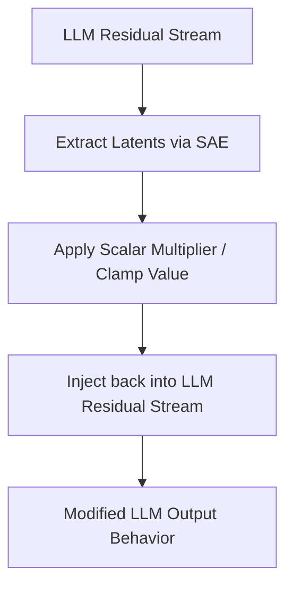

# Steerable Concept Intervention (Policy Steering)

Steerable Concept Intervention moves past passive observation to active control of Large Language Models.

## Core Mechanics
Once a monosemantic feature node is located via the SAE, engineers can apply an explicit scalar multiplier to clamp its activation value directly at inference time (e.g., artificially amplifying a "safety caution" feature neuron to force the model to adopt a highly risk-averse conversational persona dynamically).

## Architectural Diagram

[Back to README](../README.md)
