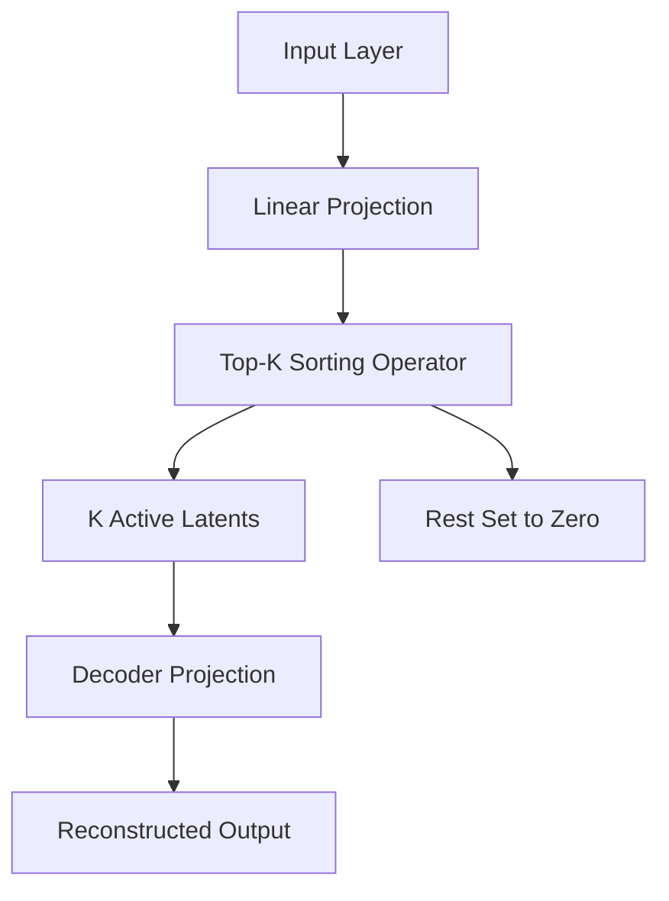

# Top-K SAEs

Top-K Sparse Autoencoders replace soft L1 penalties with a hard mathematical constraint that forces the model to activate only the top K largest activations.

## Core Mechanics
Top-K SAEs completely drop the volatile L1 loss penalty during the forward execution pass. Instead, they apply a strict non-linear **Top-K sorting operator** directly over the hidden bottleneck activations. This retains the exact numerical values of the K absolute largest neural signals, while forcing all remaining hidden units across the overcomplete tensor to zero.

## Architectural Diagram

[Back to README](../README.md)
